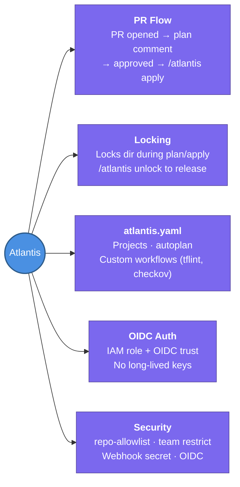

---
tags:
  - cicd/gitops
  - review
status: not-started
---
# Atlantis

Atlantis is a self-hosted server that automates `terraform plan` and `terraform apply` via GitHub/GitLab pull requests — making every infrastructure change auditable and peer-reviewed.

## 📖 Core Concepts

### The Problem Atlantis Solves
Without Atlantis: developers run `terraform apply` locally from their laptops — no audit trail, no peer review, conflicting local state.
With Atlantis: every infrastructure change goes through a PR. Atlantis comments the plan; a human reviews and approves; then `/atlantis apply` runs in a controlled, logged environment.

### Core Flow
```
1. Developer opens PR with .tf changes
2. Atlantis detects change → runs `terraform plan`
3. Posts plan output as PR comment
4. Team reviews the plan diff
5. PR approved + comment: /atlantis apply
6. Atlantis runs `terraform apply`
7. State saved to S3 + lock released
8. PR merged
```

### `atlantis.yaml` — Project Configuration
```yaml
version: 3
projects:
  - name: prod-vpc
    dir: environments/prod/vpc
    workspace: default
    autoplan:
      when_modified:
        - "*.tf"
        - "*.tfvars"
        - "../../modules/vpc/**/*.tf"
      enabled: true
    workflow: terraform-with-checks

workflows:
  terraform-with-checks:
    plan:
      steps:
        - run: tflint
        - run: checkov -d . --quiet
        - init
        - plan
    apply:
      steps:
        - apply
```

### Key Atlantis Concepts

#### Autoplan
Atlantis auto-runs `plan` when a PR modifies files matching `when_modified` patterns. Useful for monorepos where a module change should trigger plans in all consuming environments.

#### Locking
- Atlantis locks a project directory during `plan` → prevents concurrent plans/applies on the same directory
- Lock is released after `apply` or can be manually released: `/atlantis unlock`
- Prevents race conditions on shared state

#### Plan Comments
Atlantis posts the full `terraform plan` output as a PR comment (trimmed if too long). Reviewers see exactly what will change before approving.

#### Commands via PR Comments
| Comment | Action |
|---------|--------|
| `/atlantis plan` | (Re)run plan for all projects in PR |
| `/atlantis plan -d path/to/dir` | Plan a specific directory |
| `/atlantis apply` | Apply all planned projects |
| `/atlantis apply -d path/to/dir` | Apply a specific directory |
| `/atlantis unlock` | Release all locks for the PR |

### Running Atlantis Server
```bash
atlantis server \
  --atlantis-url=https://atlantis.example.com \
  --gh-user=atlantis-bot \
  --gh-token=$GITHUB_TOKEN \
  --gh-webhook-secret=$WEBHOOK_SECRET \
  --repo-allowlist="github.com/myorg/*" \
  --config=atlantis.yaml
```
Typically deployed as a Kubernetes Deployment or ECS task.

### OIDC Auth to AWS — No Long-Lived Credentials
```hcl
# IAM role with OIDC trust (EKS IRSA or GitHub OIDC)
resource "aws_iam_role" "atlantis" {
  name = "atlantis-terraform-role"
  assume_role_policy = jsonencode({
    Statement = [{
      Effect    = "Allow"
      Principal = { Federated = aws_iam_openid_connect_provider.eks.arn }
      Action    = "sts:AssumeRoleWithWebIdentity"
      Condition = {
        StringEquals = {
          "${local.oidc_issuer}:sub" = "system:serviceaccount:atlantis:atlantis"
        }
      }
    }]
  })
}
```

### Security Considerations
- Only allow trusted repos via `--repo-allowlist`
- Restrict `/atlantis apply` to specific GitHub teams using `--automerge` or branch protection
- Use OIDC / IAM roles instead of long-lived `AWS_ACCESS_KEY_ID` env vars
- Store `--gh-token` and webhook secrets in Kubernetes secrets or Vault

### Atlantis vs GitHub Actions for Terraform
| | Atlantis | GitHub Actions |
|-|----------|---------------|
| Purpose-built for Terraform | ✅ Yes | ❌ General-purpose |
| Built-in state locking | ✅ Yes | ❌ DIY |
| Plan comment on PR | ✅ Automatic | 🛠 Needs extra action |
| Flexibility | Lower | Higher |
| Self-hosted requirement | ✅ Always | Optional |
| Terragrunt support | ✅ Via custom workflow | ✅ Via CLI |

### Terragrunt + Atlantis
```yaml
# atlantis.yaml with Terragrunt workflow
workflows:
  terragrunt:
    plan:
      steps:
        - run: terragrunt plan -out=$PLANFILE
    apply:
      steps:
        - run: terragrunt apply $PLANFILE
```

## 🔗 Connections (Zettelkasten)
- **Relates to:** [[1. Terraform Core Concepts]] — Atlantis runs Terraform commands in a controlled, auditable way
- **Relates to:** [[Terraform/Testing & Validation|Testing & Validation]] — custom Atlantis workflows run `tflint` and `checkov` before `plan`
- **Relates to:** [[2. Terragrunt]] — Terragrunt workflows can be configured inside `atlantis.yaml`
- **Relates to:** [[Terraform/State Management|State Management]] — Atlantis manages state locking across concurrent PRs
- **Core Use Case:** Enforce that all production Terraform changes are peer-reviewed, planned, and applied from a single auditable system — no "cowboy applies" from local machines

---

## 🏗️ Proof of Work
- **Lab/Script:** Deploy Atlantis to EKS using Helm; configure a repo webhook; open a PR with a `.tf` change and verify plan comment appears
- **Verification Command:** `kubectl logs -n atlantis deployment/atlantis` — verify webhook received and plan executed

---

## 🛠️ Study Aids

### 🧠 Mind Map


### 🗂️ Flashcards
#flashcards

**What is Atlantis and what problem does it solve?**
?
Atlantis is a self-hosted server that automates `terraform plan/apply` via PR comments. It solves the "cowboy apply" problem — without it, developers run Terraform locally with no audit trail or peer review. With Atlantis, every infra change is: proposed in a PR → planned automatically → plan reviewed by team → applied on approval → state locked to prevent conflicts.

---

**How does Atlantis prevent concurrent applies from corrupting Terraform state?**
?
Atlantis implements **directory-level locking**: when a plan starts for a directory, it acquires a lock. Any other PR trying to plan/apply the same directory is rejected until the lock is released. Locks are released automatically after `apply` completes, or manually with `/atlantis unlock`.

---

**How should Atlantis authenticate to AWS in production?**
?
Use **OIDC / IAM Roles** — not long-lived `AWS_ACCESS_KEY_ID` environment variables. When Atlantis runs on EKS, configure an OIDC trust policy on an IAM role and use IRSA (IAM Roles for Service Accounts) to bind the Atlantis Kubernetes service account to the role. This way, credentials are short-lived, automatically rotated, and scoped to just what Atlantis needs.
