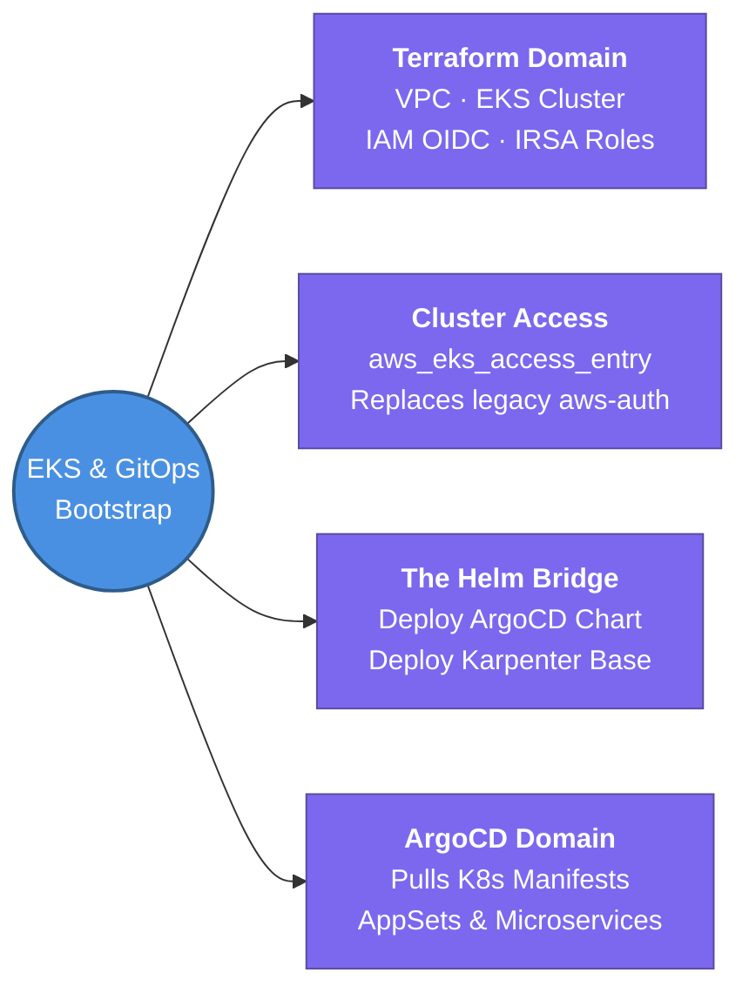

---
tags:
  - iac/terraform
  - kubernetes/eks
  - review
status: not-started
Repetition: rep/1
Next-Review: 
---
# EKS & GitOps Bootstrapping with Terraform

## 📖 Core Concepts
### 1st Repetition: Active Capture (In-Class)
*Explain the concept using the Feynman Technique:*
Provisioning an AWS EKS cluster requires coordinating networking, IAM control planes, worker nodes, and Kubernetes add-ons. Terraform handles the infrastructure layer (`terraform-aws-modules/eks/aws`), but once the cluster is online, day-2 app deployment should shift to GitOps (ArgoCD).

*Fast, structured notes using symbols (→, ↑, ★):*
- ★ **Separation of Concerns:** Terraform owns Infrastructure (VPC, EKS Control Plane, Karpenter Node Groups, OIDC providers, IRSA IAM roles) → ArgoCD owns Kubernetes Manifests & Microservices.
- → **Bootstrapping Flow:** `aws_vpc` → `aws_eks_cluster` + OIDC Trust → Helm Provider deploys ArgoCD + Karpenter Controller → ArgoCD syncs Git repository.
- ★ **IRSA (IAM Roles for Service Accounts):** Bridges AWS IAM with Kubernetes RBAC using an OIDC identity provider attached to EKS. Prevents granting EC2 node-wide permissions.
- ↑ **Karpenter Autoscaling:** Deploy Karpenter IAM roles and AWS SQS queue via Terraform → just-in-time worker nodes scale rapidly ↑.
- ⚠️ **The Destroy Gotcha:** If Terraform manages Kubernetes resources inside EKS, deleting the VPC or API endpoint first will hang `terraform destroy`. Always decouple Kubernetes providers or use staged destroys.

### 2nd Repetition: Synthesis & Recall (Out-of-Class - 20 mins later)
*Synthesis of core engineering principles:*
1. **OIDC Identity Provider Setup:** Every EKS cluster needs an OIDC provider registered in IAM (`aws_iam_openid_connect_provider`). This lets Kubernetes pods trade a Kubernetes service account token for a short-lived AWS IAM credential via STS.
2. **Cluster Access & RBAC:** In AWS EKS v1.23+, use AWS IAM Access Entries (`aws_eks_access_entry` and `aws_eks_access_policy_association`) instead of managing the legacy `aws-auth` ConfigMap in HCL. This prevents locking yourself out of cluster administration.
3. **The GitOps Bridge:** Use the Terraform `helm` and `kubernetes` providers ONLY to install the ArgoCD Helm chart and root ApplicationSet. Once ArgoCD is running, let it pull all subsequent cluster services from Git.

---

## 🔗 Connections (Zettelkasten)
- **Part of:** [[1. Terraform Core Concepts]]
- **Relates to:** [[6. EKS Architecture|EKS Architecture]] — Understand control plane vs worker nodes and API communications.
- **Relates to:** [[ArgoCD]] — GitOps engine bootstrapped by Terraform to manage ongoing Kubernetes delivery.
- **Relates to:** [[1. VPC Deep Dive]] — EKS network architecture requires private subnets for worker nodes and public/private endpoint access for the control plane.
- **Core Use Case:** Stand up a production-ready, self-scaling Kubernetes cluster on AWS from scratch in a single declarative command, bridged directly into an automated GitOps deployment loop.

---

## 🏗️ Proof of Work
- **Lab/Script:** [[VPC/VPC-Terraform-Labs]] — Deploy EKS across Lab 5 private app subnets.
- **Verification Command:** `terraform state list | grep aws_eks_cluster && aws eks update-kubeconfig --name <cluster_name> --region <region>`

---

## 🛠️ Study Aids

### 🧠 Mind Map

### 🗂️ Flashcards

#flashcards/iac

**Why should you avoid deploying everyday microservices and application manifests directly with Terraform's `kubernetes_manifest` resource?**
?
Terraform's state file is not designed for continuous reconciliation against drifting Kubernetes state. If an API endpoint fails or a pod resets, Terraform apply can hang or desync. Best practice: Use Terraform only for infrastructure and bootstrapping the ArgoCD controller, then let ArgoCD (GitOps) manage ongoing Kubernetes deployments.
<!--SR:!2026-08-05,3,250-->

---

**What AWS IAM feature eliminates the need to edit the `aws-auth` ConfigMap in Kubernetes when granting AWS IAM users/roles administrative access to EKS?**
?
AWS EKS IAM Access Entries (`aws_eks_access_entry` and `aws_eks_access_policy_association`). This native AWS API manages cluster permissions directly via IAM without editing in-cluster ConfigMaps.
<!--SR:!2026-08-05,3,250-->

---

**What problem does IRSA (IAM Roles for Service Accounts) solve in an EKS Terraform architecture?**
?
Without IRSA, an application pod running on an EC2 worker node has to inherit the node's overarching instance profile IAM role, violating least privilege. IRSA uses an AWS IAM OIDC identity provider attached to EKS to allow individual Kubernetes ServiceAccounts to assume scoped AWS IAM roles directly via STS.
<!--SR:!2026-08-05,3,250-->
