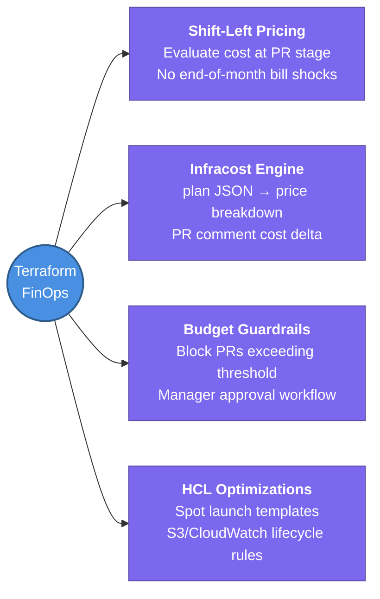

---
tags:
  - iac/terraform
  - review
status: not-started
Repetition: rep/1
Next-Review: 
---
# FinOps & Cost Optimization with Terraform (Infracost)

## 📖 Core Concepts
### 1st Repetition: Active Capture (In-Class)
*Explain the concept using the Feynman Technique:*
Writing code in Terraform is ultimately writing a check against your cloud infrastructure budget. "Shift-Left FinOps" means evaluating and optimizing the precise dollar cost of an architecture change during the pull request phase before `terraform apply` executes.

*Fast, structured notes using symbols (→, ↑, ★):*
- ★ **Shift-Left Financial Accountability:** Don't wait for a surprise monthly bill from AWS Cost Explorer. Catch expensive resources directly in Git PR reviews.
- → **Infracost Pipeline:** `terraform plan -out=tfplan.binary` → `terraform show -json tfplan.binary > plan.json` → `infracost breakdown --path plan.json` → Comment exact hourly/monthly pricing diff on PR.
- ↑ **Unchecked OPEX Drivers:** Over-provisioned EBS volume sizes, multi-AZ NAT Gateways running 24/7 in idle test environments, and oversized DB instances cause expenditures to surge ↑.
- ★ **Architectural Cost Reduction:** Replace fixed EC2 fleets with Spot launch templates; shut down staging workspaces overnight; enforce tagging mandates (`local.common_tags`) with Cost Center allocations.

### 2nd Repetition: Synthesis & Recall (Out-of-Class - 20 mins later)
*Synthesis of cost guardrails & HCL best practices:*
1. **Automated Budget Guardrails in CI/CD:** Using tools like Infracost integrated with Atlantis or GitHub Actions, pipelines can evaluate cost diffs. If a proposed change exceeds a designated budget threshold (e.g., +$250/month delta), the pipeline can automatically flag a manager for sign-off or fail the build.
2. **Spot Instance Orchestration in HCL:** When provisioning node fleets (EC2 ASGs or EKS Karpenter compute classes), define mixed-instances policies in HCL (`aws_launch_template` with spot allocation strategies like `capacity-optimized`). This achieves 60–80% compute discounts while handling interruptions gracefully.
3. **Lifecycle & Storage Tiering:** Always configure lifecycle policies in Terraform for storage blocks (`aws_s3_bucket_lifecycle_configuration` and CloudWatch Log group retention intervals) to prevent infinite log growth and orphan snapshot charges.

---

## 🔗 Connections (Zettelkasten)
- **Part of:** [[1. Terraform Core Concepts]]
- **Relates to:** [[3. Atlantis]] — Automate Infracost evaluation summaries as comments directly inside pull request workflows.
- **Relates to:** [[Terraform/5. Workspaces & Environments|5. Workspaces & Environments]] — Use environment variable flags to deploy zero-cost stubs or single-AZ topologies in non-production environments.
- **Relates to:** [[1. VPC Deep Dive]] — NAT Gateway and cross-AZ data transfer costs are primary network FinOps optimization targets.
- **Core Use Case:** Provide proactive cost transparency and prevent infrastructure spend anomalies across enterprise multi-account environments before resources are instantiated.

---

## 🏗️ Proof of Work
- **Lab/Script:** Integrate Infracost CLI against local Terraform configurations in [[VPC/VPC-Terraform-Labs]].
- **Verification Command:** `terraform plan -out=tfplan.binary && terraform show -json tfplan.binary | infracost breakdown --path -`

---

## 🛠️ Study Aids

### 🧠 Mind Map

### 🗂️ Flashcards

#flashcards/iac

**How does Infracost evaluate the cost of a pending Terraform change without deploying resources to AWS?**
?
Infracost parses the JSON output of `terraform plan` (`terraform show -json tfplan.binary`). It maps the intended HCL resource changes and attribute modifications against public (or negotiated) AWS cloud pricing APIs to calculate exact hourly and monthly cost deltas before `terraform apply` is executed.
<!--SR:!2026-08-05,3,250-->

---

**What is "Shift-Left FinOps" in the context of GitOps and Infrastructure as Code?**
?
Moving financial visibility and cost decisions early into the engineering architecture and pull-request phase (e.g., via automated CI/CD cost estimates in PR review) rather than reacting to retrospective cloud bills at the end of the month.
<!--SR:!2026-08-05,3,250-->

---

**What are three high-impact HCL coding patterns to optimize AWS monthly costs in Terraform?**
?
1. **Spot Compute Adoption:** Using `aws_launch_template` with spot allocation strategies in Auto Scaling or EKS node configurations.
2. **Automated Retention Limiters:** Adding explicit retention periods to `aws_cloudwatch_log_group` and lifecycle rules to `aws_s3_bucket`.
3. **Environment-Conditioned Sizing:** Using ternary operators (`var.env == "prod" ? 3 : 1`) to deploy multi-AZ redundancy only in production while running single-AZ cost-minimized stubs in staging/dev.
<!--SR:!2026-08-05,3,250-->
