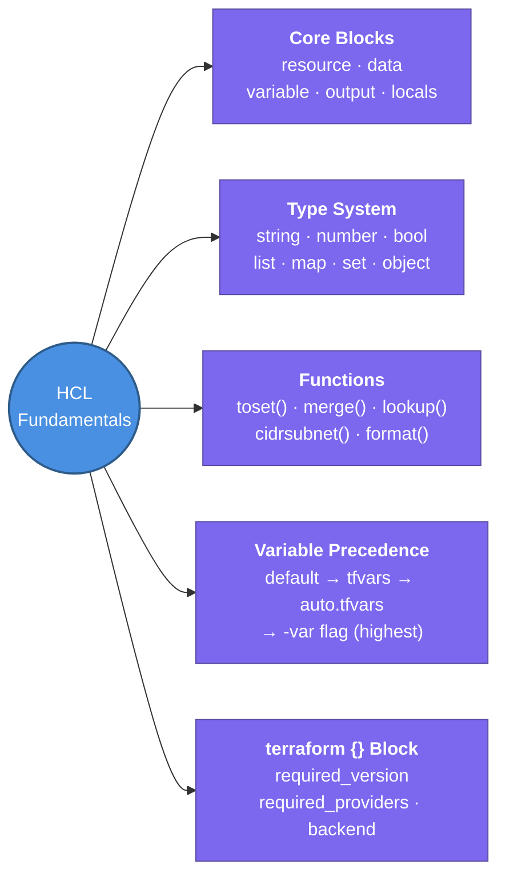

---
tags:
  - iac/terraform
  - review
status: not-started
---
# HCL Fundamentals

HCL (HashiCorp Configuration Language) is the declarative syntax used to write all Terraform configurations.

## 📖 Core Concepts

### File Structure
Every Terraform project is a directory of `.tf` files. Standard layout:
```
module/
├── main.tf        ← primary resource declarations
├── variables.tf   ← input variable declarations
├── outputs.tf     ← exported values
├── provider.tf    ← provider configuration
└── versions.tf    ← required_providers, required_version
```

### The `terraform {}` Block
Top-level settings for the configuration:
```hcl
terraform {
  required_version = ">= 1.5"
  required_providers {
    aws = {
      source  = "hashicorp/aws"
      version = "~> 5.0"
    }
  }
  backend "s3" { ... }
}
```

### `provider {}` Block
Configures the provider plugin (authentication, region, etc.):
```hcl
provider "aws" {
  region = var.aws_region
}
```

### `resource {}` Block — Unit of managed infrastructure
```hcl
resource "aws_vpc" "main" {
  cidr_block = var.vpc_cidr
  tags = { Name = "main-vpc" }
}
```
Format: `resource "<TYPE>" "<LOCAL_NAME>" { ... }`

### `data {}` Block — Read-only data sources
Reads existing external data without managing it:
```hcl
data "aws_availability_zones" "available" {
  state = "available"
}
```
Reference: `data.aws_availability_zones.available.names`

### `variable {}` Block — Input parameters
```hcl
variable "vpc_cidr" {
  type        = string
  description = "CIDR block for the VPC"
  default     = "10.0.0.0/16"
  sensitive   = false
  validation {
    condition     = can(cidrnetmask(var.vpc_cidr))
    error_message = "Must be a valid CIDR block."
  }
}
```

### `output {}` Block — Export values
```hcl
output "vpc_id" {
  value       = aws_vpc.main.id
  description = "The ID of the main VPC"
}
```

### `locals {}` Block — Computed values, reduce repetition
```hcl
locals {
  common_tags = {
    Environment = var.environment
    Team        = "platform"
    ManagedBy   = "terraform"
  }
}
```
Reference: `local.common_tags`

### Type System
| Type | Example |
|------|---------|
| `string` | `"us-east-1"` |
| `number` | `3` |
| `bool` | `true` |
| `list(string)` | `["a", "b"]` |
| `map(string)` | `{key = "val"}` |
| `set(string)` | unordered unique strings |
| `object({...})` | `{name = string, count = number}` |

### Variable Precedence (lowest → highest)
1. Default value in `variable {}` block
2. `TF_VAR_<name>` environment variable
3. `terraform.tfvars` (auto-loaded)
4. `*.auto.tfvars` (auto-loaded, alphabetical)
5. `-var "name=value"` CLI flag
6. `-var-file=file.tfvars` CLI flag

### Key Built-in Functions
| Function | Purpose |
|----------|---------|
| `length(list)` | count elements |
| `toset(list)` | deduplicate, for `for_each` |
| `tomap(obj)` | convert to map |
| `lookup(map, key, default)` | safe map access |
| `merge(map1, map2)` | combine maps |
| `flatten(list_of_lists)` | one-level flatten |
| `format("%s-%s", a, b)` | string formatting |
| `join(",", list)` | list → string |
| `split(",", str)` | string → list |
| `cidrsubnet(cidr, bits, idx)` | subnet calculation |

### String Interpolation
```hcl
name = "${var.environment}-${var.project}-vpc"
```

### Conditional Expression
```hcl
instance_type = var.environment == "prod" ? "t3.large" : "t3.micro"
```

## 🔗 Connections (Zettelkasten)
- **Part of:** [[1. Terraform Core Concepts]]
- **Relates to:** [[Terraform/State Management|State Management]] — every resource block creates a state entry
- **Relates to:** [[Terraform/Modules|Modules]] — modules are built from these same blocks
- **Relates to:** [[VPC/VPC-Terraform-Labs|VPC Terraform Labs]] — apply HCL fundamentals hands-on
- **Core Use Case:** Write any Terraform configuration — understanding these blocks is the prerequisite for everything else

---

## 🏗️ Proof of Work
- **Lab/Script:** [[VPC/VPC-Terraform-Labs|VPC Terraform Labs]] — Lab 1 applies variables, resources, outputs
- **Verification Command:** `terraform validate && terraform fmt -check`

---

## 🛠️ Study Aids

### 🧠 Mind Map


### 🗂️ Flashcards
#flashcards/iac

**What is the difference between a `resource` block and a `data` block in Terraform?**
?
`resource` creates and manages infrastructure (Terraform owns its lifecycle). `data` reads existing external data read-only — Terraform does NOT create, update, or destroy it. Example: `data "aws_ami" "ubuntu"` fetches the latest Ubuntu AMI ID without creating anything.

---

**What is the variable precedence order in Terraform (lowest to highest)?**
?
1. `default` in variable block (lowest)
2. `TF_VAR_<name>` env variable
3. `terraform.tfvars` (auto-loaded)
4. `*.auto.tfvars` (auto-loaded, alphabetical)
5. `-var-file=file.tfvars` CLI flag
6. `-var "name=val"` CLI flag (highest)

---

**What does `sensitive = true` on a variable do?**
?
Terraform redacts the value from plan/apply console output (shown as `(sensitive value)`). It does NOT encrypt the value in state — it still exists in `terraform.tfstate` in plaintext. Always encrypt your S3 state bucket.

---

**What is a `locals {}` block used for?**
?
Defining computed or repeated values that don't need to be inputs or outputs. Reduces repetition — e.g., `local.common_tags` can be a map of tags merged and reused across all resources. Unlike variables, locals can't be overridden from outside the module.
