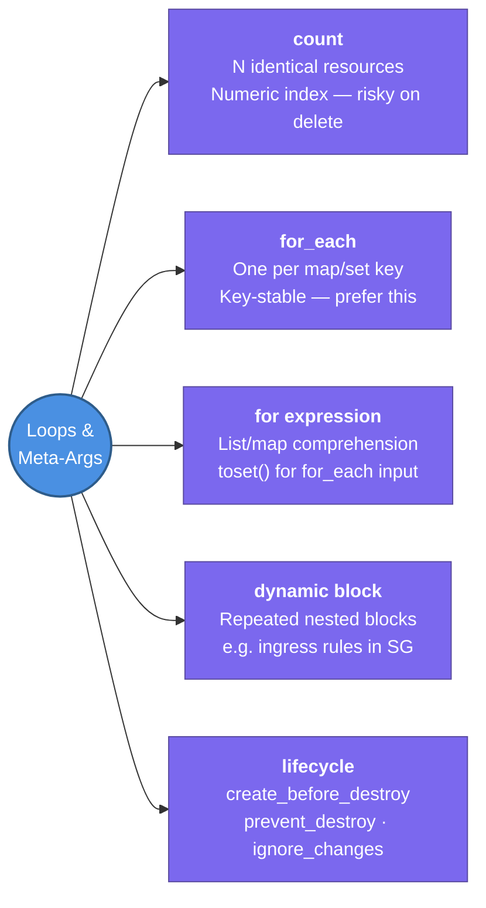

---
tags:
  - iac/terraform
  - review
status: not-started
---
# Loops & Meta-Arguments

Terraform provides several tools to avoid repetition: `count` and `for_each` for creating multiple resource instances, `dynamic` for repeated nested blocks, and `lifecycle` / `depends_on` to control resource behaviour.

## 📖 Core Concepts

### `count` — Create N Identical Resources
```hcl
resource "aws_instance" "worker" {
  count         = 3
  ami           = "ami-0abc123"
  instance_type = "t3.micro"
  tags = { Name = "worker-${count.index}" }  # 0, 1, 2
}

# Reference a specific instance
output "worker_ids" {
  value = aws_instance.worker[*].id  # splat expression → list
}
```
**Risk**: if you remove element at index 0, Terraform shifts all indices — it sees index 1 as a new resource and tries to destroy+recreate all shifted resources.

### `for_each` — One Resource Per Map/Set Entry
```hcl
resource "aws_subnet" "public" {
  for_each          = toset(["us-east-1a", "us-east-1b"])
  availability_zone = each.key
  cidr_block        = cidrsubnet("10.0.0.0/16", 8, index(["us-east-1a","us-east-1b"], each.key))
  vpc_id            = aws_vpc.main.id
  tags = { Name = "public-${each.key}" }
}

# Reference a specific instance
output "subnet_ids" {
  value = { for k, v in aws_subnet.public : k => v.id }
}
```
**Safe**: removing `us-east-1b` from the set only removes that one subnet — no index shifting.

### `count` vs `for_each` Decision Guide
| | `count` | `for_each` |
|-|---------|-----------|
| **Use when** | Resources are identical, interchangeable | Resources differ by a stable key |
| **Index type** | Number (0, 1, 2…) | String key |
| **Deletion safety** | ❌ Shifts indices | ✅ Key-stable |
| **Reference** | `resource[0].id` | `resource["key"].id` |
| **Example** | 3 identical workers | 1 subnet per AZ |

### `for` Expression — Transform Collections
```hcl
# List comprehension
variable "names" { default = ["alice", "bob"] }
locals {
  upper_names = [for n in var.names : upper(n)]  # ["ALICE", "BOB"]
}

# Map comprehension
locals {
  name_lengths = { for n in var.names : n => length(n) }  # {alice=5, bob=3}
}
```

### `toset()` — Convert List → Set for `for_each`
```hcl
for_each = toset(var.availability_zones)
# Removes duplicates, unordered — safe for for_each keys
```

### `dynamic` Block — Repeated Nested Blocks
Instead of duplicating `ingress {}` rules:
```hcl
variable "allowed_ports" { default = [80, 443, 22] }

resource "aws_security_group" "app" {
  name   = "app-sg"
  vpc_id = aws_vpc.main.id

  dynamic "ingress" {
    for_each = var.allowed_ports
    content {
      from_port   = ingress.value
      to_port     = ingress.value
      protocol    = "tcp"
      cidr_blocks = ["0.0.0.0/0"]
    }
  }
}
```

### `depends_on` — Explicit Dependency
Use **sparingly** — Terraform auto-infers dependencies from attribute references. Only needed when a dependency exists that Terraform can't see (e.g., a side-effect from a `null_resource`):
```hcl
resource "aws_instance" "app" {
  depends_on = [aws_iam_role_policy_attachment.app_policy]
}
```

### `lifecycle` Block — Control Resource Lifecycle
```hcl
resource "aws_instance" "web" {
  # ...

  lifecycle {
    create_before_destroy = true   # zero-downtime replacement
    prevent_destroy       = true   # error if Terraform tries to destroy this
    ignore_changes        = [ami, tags]  # ignore drift on these attrs
    replace_triggered_by  = [aws_launch_template.app.id]  # force replace when this changes
  }
}
```
| Argument | Purpose |
|----------|---------|
| `create_before_destroy` | Create replacement before destroying old (avoids downtime) |
| `prevent_destroy` | Safeguard — blocks destroy on prod resources |
| `ignore_changes` | Treat specified attributes as immutable from Terraform's perspective |
| `replace_triggered_by` | Force resource replacement when a referenced object changes |

### Conditional Resource
```hcl
variable "create_nat_gateway" { default = true }

resource "aws_nat_gateway" "main" {
  count = var.create_nat_gateway ? 1 : 0
  # ...
}

# Reference (may be empty list)
nat_gateway_id = length(aws_nat_gateway.main) > 0 ? aws_nat_gateway.main[0].id : null
```

### `null_resource` — Side Effects Without Real Infrastructure
```hcl
resource "null_resource" "run_script" {
  triggers = { always_run = timestamp() }

  provisioner "local-exec" {
    command = "bash ./post-deploy.sh ${aws_instance.app.public_ip}"
  }
}
```

## 🔗 Connections (Zettelkasten)
- **Part of:** [[1. Terraform Core Concepts]]
- **Relates to:** [[Terraform/HCL Fundamentals|HCL Fundamentals]] — `for_each` and `count` are meta-arguments on resource blocks
- **Relates to:** [[Terraform/Modules|Modules]] — `for_each` on a `module {}` block creates multiple module instances
- **Relates to:** [[VPC/VPC-Terraform-Labs|VPC Terraform Labs]] — Lab 1 stretch goal uses `for_each` for subnets
- **Core Use Case:** Replace copy-pasted resource blocks with `for_each` over a map of AZ → CIDR to create subnets DRY across environments

---

## 🏗️ Proof of Work
- **Lab/Script:** [[VPC/VPC-Terraform-Labs|VPC Terraform Labs]] Lab 1 — stretch: use `for_each` instead of count for subnets
- **Verification Command:** `terraform plan` — confirm no index-based destroy/recreate when removing one item

---

## 🛠️ Study Aids

### 🧠 Mind Map


### 🗂️ Flashcards
#flashcards/iac

**Why is `for_each` preferred over `count` for subnets in Terraform?**
?
`count` uses numeric indices — if you remove an item from the middle, all subsequent indices shift and Terraform sees them as new resources, triggering unnecessary destroy+recreate. `for_each` uses stable string keys (e.g., AZ names) — removing one key only removes that one resource, leaving all others untouched.

---

**What does `create_before_destroy = true` in a `lifecycle` block do?**
?
Reverses Terraform's default destroy-then-create order to create-then-destroy. This enables zero-downtime replacements — the new resource exists and is ready before the old one is removed. Required when a resource can't have a gap (e.g., an EC2 instance behind an ALB target group).

---

**How does a `dynamic` block work? Give an example use case.**
?
A `dynamic` block generates repeated nested configuration blocks at plan time using `for_each`. Use case: a Security Group with variable ingress rules. Instead of hardcoding one `ingress {}` block per port, use `dynamic "ingress" { for_each = var.ports content { from_port = ingress.value } }`. The `content {}` block becomes one `ingress {}` block per iteration.
