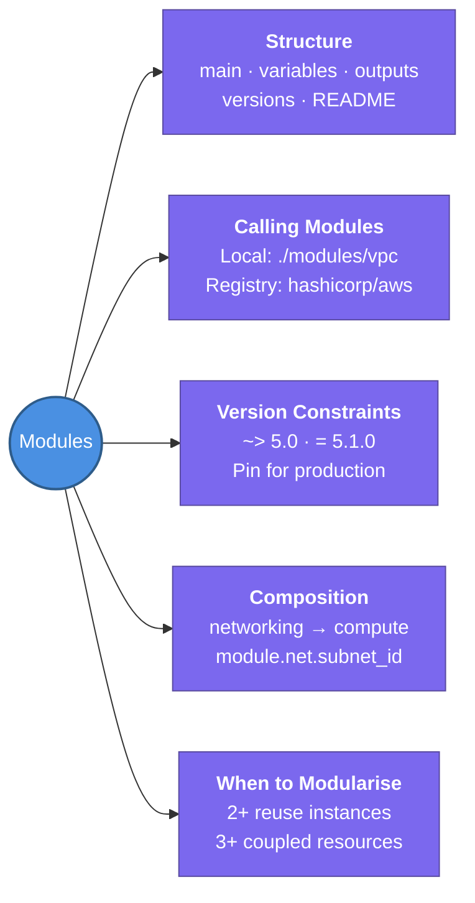

---
tags:
  - iac/terraform
  - review
status: not-started
---
# Modules

Modules are Terraform's mechanism for reuse — a directory of `.tf` files that encapsulates a logical piece of infrastructure and can be called multiple times with different inputs.

## 📖 Core Concepts

### Every Directory is a Module
- **Root module**: the directory you run `terraform apply` from
- **Child module**: called via a `module {}` block from another module
- Even a simple `main.tf` in a folder is technically a module

### Standard Module Structure
```
modules/vpc/
├── main.tf         ← resource declarations
├── variables.tf    ← input declarations (the module's "API")
├── outputs.tf      ← exported values
├── README.md       ← usage examples, inputs/outputs table
└── versions.tf     ← required_providers, required_version
```

### Calling a Module
**Local module:**
```hcl
module "vpc" {
  source = "./modules/vpc"

  vpc_cidr    = "10.0.0.0/16"
  environment = "prod"
}
```

**Registry module:**
```hcl
module "vpc" {
  source  = "terraform-aws-modules/vpc/aws"
  version = "~> 5.0"

  name = "prod-vpc"
  cidr = "10.0.0.0/16"
  azs  = ["us-east-1a", "us-east-1b"]
}
```

### Accessing Module Outputs
```hcl
# In the calling module (root or parent)
resource "aws_instance" "app" {
  subnet_id = module.vpc.private_subnets[0]
}
```
Outputs must be declared in the child module's `outputs.tf` to be accessible.

### Version Constraints (Registry Modules)
| Constraint | Meaning |
|------------|---------|
| `"= 5.1.0"` | Exact version only |
| `"~> 5.0"` | Any 5.x (pessimistic — allows patch/minor) |
| `">= 5.0, < 6.0"` | Range |
| `"!= 5.1.0"` | Exclude specific version |

**Best practice**: pin to `~> major.minor` in production for repeatable builds.

### When to Create a Module
✅ Create a module when:
- Same resource pattern appears in 2+ places (DRY)
- 3+ tightly coupled resources belong together (VPC = vpc + subnets + IGW + route tables)
- You want to enforce conventions/defaults across teams

❌ Don't modularize:
- A single resource with no reuse potential
- Just to "organise" — prefer flat configs for simple stacks

### Module Composition Pattern
```hcl
# Root module calling two child modules
module "networking" {
  source = "./modules/networking"
  vpc_cidr = "10.0.0.0/16"
}

module "compute" {
  source    = "./modules/compute"
  subnet_id = module.networking.private_subnet_id  # output from networking
}
```

### Terraform Registry
- **URL**: `registry.terraform.io`
- Official modules (e.g. `hashicorp/consul/aws`)
- Community modules (e.g. `terraform-aws-modules/vpc/aws`)
- **`terraform-aws-modules`**: the most widely used collection of battle-tested AWS modules
  - `vpc`, `eks`, `rds`, `alb`, `iam`, `s3-bucket`, `security-group`, `autoscaling`

### Module Inputs & Validation
In `variables.tf` of the child module:
```hcl
variable "environment" {
  type        = string
  description = "Deployment environment (dev/stg/prod)"
  validation {
    condition     = contains(["dev", "stg", "prod"], var.environment)
    error_message = "Must be dev, stg, or prod."
  }
}
```

### Installing Modules
```bash
terraform init    # downloads registry modules to .terraform/modules/
terraform get     # updates module sources without full init
```

## 🔗 Connections (Zettelkasten)
- **Part of:** [[1. Terraform Core Concepts]]
- **Relates to:** [[Terraform/HCL Fundamentals|HCL Fundamentals]] — modules are built from the same blocks (resource, variable, output)
- **Relates to:** [[Terraform/Loops & Meta-Arguments|Loops & Meta-Arguments]] — `for_each` on a module block creates multiple instances
- **Relates to:** [[Terraform/State Management|State Management]] — each module root can have its own remote state; `terraform_remote_state` connects them
- **Relates to:** [[2. Terragrunt]] — Terragrunt wraps modules to make multi-env deployment DRY
- **Core Use Case:** Build a reusable VPC module that can be instantiated identically across dev/stg/prod with just different variable inputs

---

## 🏗️ Proof of Work
- **Lab/Script:** Upcoming — Reusable VPC Module (see [[VPC/VPC-Terraform-Labs|VPC Terraform Labs]] Stretch Goal, Lab 5)
- **Verification Command:** `terraform get` · `terraform state list | grep module`

---

## 🛠️ Study Aids

### 🧠 Mind Map


### 🗂️ Flashcards
#flashcards/iac

**What is the difference between the root module and a child module in Terraform?**
?
The **root module** is the directory you run `terraform apply` from — it's the top of the call graph. A **child module** is any module called via a `module {}` block. The root module manages state; child modules have no independent state — all resources they create appear in the root's state file.

---

**What does the `~>` version constraint mean in Terraform?**
?
The **pessimistic constraint operator** — allows only the rightmost version component to increment. `~> 5.0` allows `5.0.x` and `5.1.0` but NOT `6.0.0`. `~> 5.1.2` allows `5.1.2` and `5.1.3` but NOT `5.2.0`. Use it in production to get patch fixes without accidental major-version upgrades.

---

**How do you reference an output from a child module?**
?
`module.<MODULE_NAME>.<OUTPUT_NAME>`. The output must be declared in the child module's `outputs.tf`. Example: `module.vpc.private_subnet_ids[0]`. If the output isn't exported from the child module, it's not accessible from the parent.
