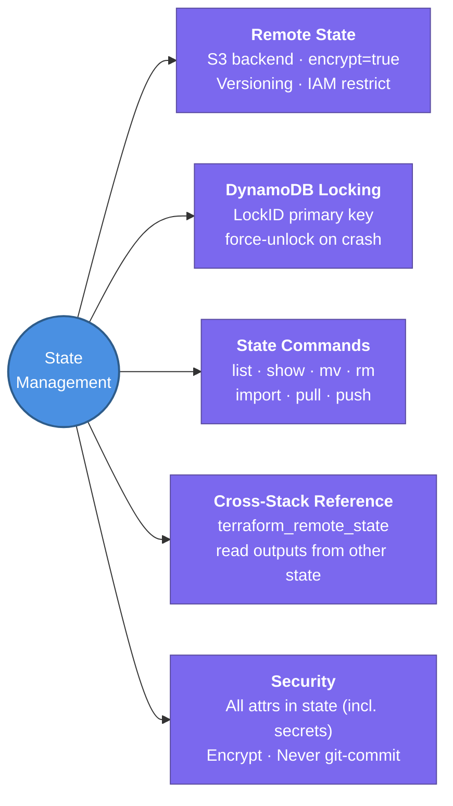

---
tags:
  - iac/terraform
  - review
status: not-started
---
# State Management

Terraform state is the source of truth that maps your HCL configuration to real deployed resources — without it, every plan would try to create everything from scratch.

## 📖 Core Concepts

### What is the State File?
`terraform.tfstate` is a JSON file Terraform writes after every `apply`. It records:
- Every resource managed by Terraform
- The real cloud resource ID for each resource block
- All attribute values (including sensitive ones like passwords)
- Metadata (dependencies, Terraform version, serial number)

### Why Remote State?
| | Local State | Remote State (S3) |
|-|-------------|-------------------|
| Team use | ❌ Only one person | ✅ Shared |
| State locking | ❌ None | ✅ DynamoDB |
| Backup | ❌ Manual | ✅ S3 versioning |
| Security | ❌ Plaintext file | ✅ Encrypted at rest |

### S3 + DynamoDB Backend Configuration
```hcl
terraform {
  backend "s3" {
    bucket         = "my-terraform-state"
    key            = "prod/vpc/terraform.tfstate"
    region         = "us-east-1"
    encrypt        = true
    dynamodb_table = "terraform-lock"
  }
}
```

**One-time setup for the lock table (DynamoDB):**
```hcl
resource "aws_dynamodb_table" "terraform_lock" {
  name         = "terraform-lock"
  billing_mode = "PAY_PER_REQUEST"
  hash_key     = "LockID"
  attribute {
    name = "LockID"
    type = "S"
  }
}
```

### State Locking
- Terraform acquires a lock in DynamoDB before any write operation (`plan -lock`, `apply`, `destroy`)
- Prevents concurrent applies from corrupting state
- If a process crashes with the lock held: `terraform force-unlock <LOCK_ID>`
- Lock ID is shown in the error message when another operation is already running

### Key State Commands

| Command | What it does |
|---------|-------------|
| `terraform state list` | List all resources in state |
| `terraform state show <resource>` | Show all attributes for one resource |
| `terraform state mv <src> <dst>` | Rename/move resource without destroy |
| `terraform state rm <resource>` | Remove from state (real resource survives) |
| `terraform state pull` | Download current remote state as JSON |
| `terraform state push` | Upload local state to remote (⚠️ dangerous) |
| `terraform import <resource> <id>` | Import existing cloud resource into state |

### `terraform state mv` Use Cases
- Renaming a resource: `terraform state mv aws_instance.web aws_instance.app`
- Moving resource into a module: `terraform state mv aws_vpc.main module.vpc.aws_vpc.main`
- Avoids destroy+recreate when refactoring

### `terraform import`
Bring existing cloud resources under Terraform management:
```bash
terraform import aws_vpc.main vpc-0abc123def456789
```
After import, write the matching HCL resource block — `terraform plan` should show no changes.

### `terraform_remote_state` Data Source
Read outputs from another Terraform state file:
```hcl
data "terraform_remote_state" "vpc" {
  backend = "s3"
  config = {
    bucket = "my-terraform-state"
    key    = "prod/vpc/terraform.tfstate"
    region = "us-east-1"
  }
}

# Reference output from that state
subnet_id = data.terraform_remote_state.vpc.outputs.private_subnet_ids[0]
```

### Sensitive Data in State
- **All attributes are stored**, including secrets (DB passwords, API keys)
- Mitigate with: S3 encryption (`encrypt = true`), bucket versioning, strict IAM policies
- Consider: Vault or Secrets Manager for secrets; reference by ARN/ID, not plaintext value
- `terraform.tfstate` should NEVER be committed to Git

### Partial Apply / State Corruption
If `apply` fails midway, state reflects partial progress. On next `plan`, Terraform will compute the remaining delta and complete the operation. Use `-target` carefully to sequence fixes.

## 🔗 Connections (Zettelkasten)
- **Part of:** [[1. Terraform Core Concepts]]
- **Relates to:** [[Terraform/HCL Fundamentals|HCL Fundamentals]] — every resource block you write creates a state entry
- **Relates to:** [[Terraform/Modules|Modules]] — each module root can have its own remote state
- **Relates to:** [[2. Terragrunt]] — Terragrunt's `remote_state {}` block automates S3+DDB setup per module
- **Core Use Case:** Enable safe team collaboration on Terraform with remote state, locking, and the ability to refactor without destroying resources

---

## 🏗️ Proof of Work
- **Lab/Script:** Upcoming — Remote S3 Backend Lab (see [[VPC/VPC-Terraform-Labs|VPC Terraform Labs]] Upcoming Labs)
- **Verification Command:** `terraform state list` · `terraform state show <resource>`

---

## 🛠️ Study Aids

### 🧠 Mind Map


### 🗂️ Flashcards
#flashcards/iac

**How do you set up remote state in Terraform using AWS? What two resources are needed?**
?
1. **S3 bucket** — stores the `terraform.tfstate` file. Enable versioning and encryption.
2. **DynamoDB table** — state locking. Must have `LockID` as the primary key (String type).
Backend config: `backend "s3" { bucket, key, region, encrypt=true, dynamodb_table }`.

---

**What does `terraform state mv` do, and when would you use it?**
?
Moves or renames a resource in state WITHOUT destroying and recreating it in the cloud. Use it when: renaming a resource (`aws_instance.web` → `aws_instance.app`), moving a resource into a module, or refactoring module structure. Always run `terraform plan` after to confirm no unintended changes.

---

**What is `terraform force-unlock` and when is it needed?**
?
Releases a stuck DynamoDB state lock. Needed when a `terraform apply` process crashed or was killed while holding the lock — the next operation will fail with "Error acquiring the state lock". Run `terraform force-unlock <LOCK_ID>` using the ID shown in the error. Only do this when you're certain no other apply is genuinely running.

---

**Why should secrets never be stored directly in Terraform variable values?**
?
Because ALL resource attributes — including passwords and secrets — are written to `terraform.tfstate` in plaintext. If state is in S3, ensure encryption + strict IAM. Best practice: store secrets in AWS Secrets Manager or SSM Parameter Store; reference them via a `data` block and pass the ARN/ID, not the plaintext value, to Terraform resources.
