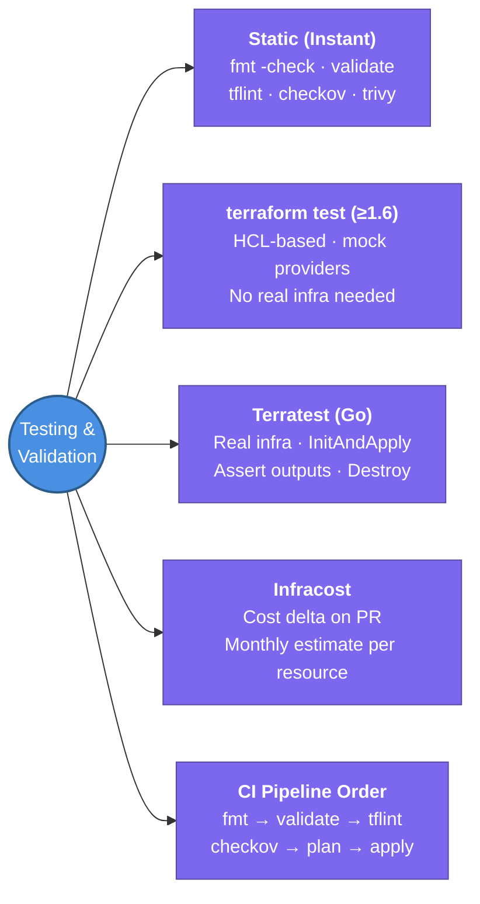

---
tags:
  - iac/terraform
  - review
status: not-started
---
# Testing & Validation

A layered testing strategy for Terraform: fast static checks catch issues before any cloud calls; integration tests deploy real infra to assert correctness.

## 📖 Core Concepts

### The Testing Pyramid for Terraform
```
         /  Terratest  \         ← Slowest, highest confidence (real infra)
        /   (Go tests)  \
       /  terraform test  \      ← Medium (native HCL, mock providers)
      /   (≥ v1.6, HCL)   \
     / checkov · tfsec     \     ← Fast (security static analysis)
    / tflint               \     ← Fast (linting, AWS-specific rules)
   / terraform validate     \    ← Instant (syntax + logic, no cloud calls)
  / terraform fmt -check     \   ← Instant (formatting only)
 /____________________________\
```

### `terraform fmt`
Auto-formats all `.tf` files to canonical style (indentation, alignment):
```bash
terraform fmt             # format all files in current dir recursively
terraform fmt -check      # exit code 1 if any file needs formatting (for CI)
terraform fmt -diff       # show diff without applying
```

### `terraform validate`
Checks syntax and logical consistency without making any AWS API calls:
```bash
terraform validate
# ✓ Success — the configuration is valid
# or: Error: Invalid reference to undeclared resource
```
Requires `terraform init` to have run (providers must be installed).

### `tflint`
Linter that catches issues `validate` misses:
- Invalid EC2 instance type names
- Invalid AMI ID format
- Deprecated syntax and removed provider arguments
- Naming convention violations (configurable)

```bash
tflint --init               # install ruleset plugins (e.g. tflint-ruleset-aws)
tflint --config=.tflint.hcl # use custom config
tflint                      # run linting
```

Example `.tflint.hcl`:
```hcl
plugin "aws" {
  enabled = true
  version = "0.29.0"
  source  = "github.com/terraform-linters/tflint-ruleset-aws"
}
```

### Checkov — Static Security Analysis
Scans IaC for security misconfigurations:
```bash
pip install checkov
checkov -d .             # scan all .tf files in directory
checkov -f main.tf       # scan single file
checkov --check CKV_AWS_18  # run specific check
checkov --skip-check CKV_AWS_144  # skip a check with justification
```

Common checks:
- S3 bucket not publicly readable (`CKV_AWS_20`)
- RDS storage not encrypted (`CKV_AWS_17`)
- Security group allows unrestricted SSH (`CKV_AWS_25`)
- CloudTrail not enabled (`CKV_AWS_35`)

### Trivy (formerly tfsec)
Unified scanner for IaC + container images:
```bash
trivy config .          # scan IaC files for security issues
trivy image nginx:latest  # also scans container images in the same pipeline
```

### Infracost — Cost Estimation
Generates cost delta for Terraform changes:
```bash
infracost diff --path .   # show monthly cost change vs current state
# Posts PR comment: "+$42.50/month" with resource breakdown
```

### Terratest — Integration Testing (Go)
Deploy real infrastructure, assert on it, destroy:
```go
func TestVPCModule(t *testing.T) {
    opts := &terraform.Options{
        TerraformDir: "../examples/vpc",
        Vars: map[string]interface{}{
            "environment": "test",
            "vpc_cidr":    "10.0.0.0/16",
        },
    }
    defer terraform.Destroy(t, opts)
    terraform.InitAndApply(t, opts)

    vpcID := terraform.Output(t, opts, "vpc_id")
    vpc := aws.GetVpcById(t, vpcID, "us-east-1")
    assert.Equal(t, "10.0.0.0/16", aws.GetVpcById(t, vpcID, "us-east-1").CidrBlock)
}
```
Run: `go test -v -timeout 30m ./test/`

### `terraform test` (Native, ≥ v1.6)
HCL-based tests with mock providers — no real cloud resources needed:
```hcl
# tests/vpc.tftest.hcl
run "valid_vpc_cidr" {
  command = plan

  variables {
    vpc_cidr = "10.0.0.0/16"
  }

  assert {
    condition     = aws_vpc.main.cidr_block == "10.0.0.0/16"
    error_message = "VPC CIDR must match input variable"
  }
}
```
Run: `terraform test`

### Full CI Pipeline Order
```
1. terraform fmt -check       → fail if unformatted
2. terraform validate         → fail on syntax errors
3. tflint                     → fail on lint violations
4. checkov / trivy            → fail on security issues
5. infracost diff             → post cost comment (non-blocking)
6. terraform plan             → post plan output to PR
7. ── MANUAL GATE: PR approval ──
8. terraform apply            → run on merge to main
```

### Pre-Commit Hooks
Enforce checks locally before push:
```yaml
# .pre-commit-config.yaml
repos:
  - repo: https://github.com/antonbabenko/pre-commit-terraform
    hooks:
      - id: terraform_fmt
      - id: terraform_validate
      - id: tflint
      - id: checkov
```

## 🔗 Connections (Zettelkasten)
- **Part of:** [[1. Terraform Core Concepts]]
- **Relates to:** [[3. Atlantis]] — Atlantis runs `plan` as part of the PR pipeline; custom workflows add `tflint`/`checkov` steps
- **Relates to:** [[Terraform/Workspaces & Environments|Workspaces & Environments]] — run tests against a dedicated test environment/workspace
- **Core Use Case:** Catch security misconfigurations and broken infrastructure before code reaches production — shift-left validation in the PR pipeline

---

## 🏗️ Proof of Work
- **Lab/Script:** Set up a pre-commit config + GitHub Actions pipeline running fmt → validate → tflint → checkov → plan
- **Verification Command:** `terraform fmt -check && terraform validate && tflint && checkov -d .`

---

## 🛠️ Study Aids

### 🧠 Mind Map


### 🗂️ Flashcards
#flashcards/iac

**What is the difference between `terraform validate` and `tflint`?**
?
`terraform validate` checks **syntax and logical consistency** — undeclared variables, missing required arguments, invalid expressions. It makes no AWS API calls. `tflint` goes further: it checks **AWS-specific correctness** like invalid instance type names, deprecated resource arguments, and naming convention violations that Terraform itself doesn't care about. Run both in CI.

---

**What does Checkov check for, and how is it different from tflint?**
?
Checkov performs **security static analysis** — it checks for infrastructure misconfigurations like publicly readable S3 buckets, unencrypted RDS, security groups open to 0.0.0.0/0, and missing CloudTrail. `tflint` checks for correctness and best-practice violations (naming, deprecated syntax). They're complementary — run both in CI.

---

**What is the recommended CI pipeline order for Terraform checks?**
?
`fmt -check` → `validate` → `tflint` → `checkov` (security) → `infracost diff` (cost, non-blocking) → `terraform plan` (post to PR) → manual PR approval → `terraform apply`. Fail fast: formatting and syntax errors catch cheap mistakes before slower security scans run.
