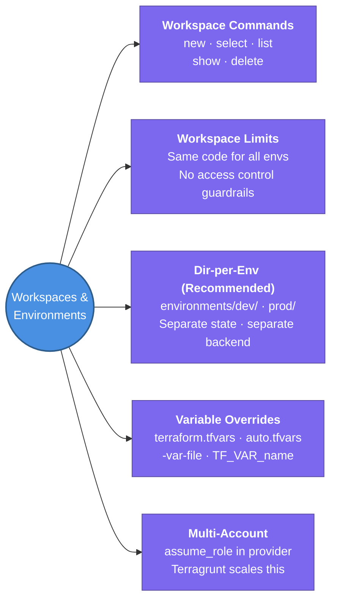

---
tags:
  - iac/terraform
  - review
status: not-started
---
# Workspaces & Environments

Terraform workspaces provide named state instances for the same configuration. For production multi-environment setups, the directory-per-environment pattern is usually safer and more flexible.

## 📖 Core Concepts

### What is a Terraform Workspace?
A workspace is a named, isolated state file within the same backend. The default workspace is `default` and always exists.

```bash
terraform workspace new dev      # create and switch to dev
terraform workspace new prod     # create and switch to prod
terraform workspace list         # list all workspaces (* = current)
terraform workspace show         # print current workspace name
terraform workspace select dev   # switch to existing workspace
terraform workspace delete stg   # delete (must be empty / not current)
```

### Using Workspace Name in Configuration
```hcl
locals {
  instance_type = terraform.workspace == "prod" ? "t3.large" : "t3.micro"
}

resource "aws_instance" "app" {
  instance_type = local.instance_type
  tags = {
    Name        = "${terraform.workspace}-app"
    Environment = terraform.workspace
  }
}
```

### Workspace Limitations
| Limitation | Why it matters |
|------------|---------------|
| Same codebase for all envs | Can't use different module versions per env |
| No access control | Easy to accidentally `apply` to prod workspace |
| State files live in same backend path | `terraform.tfstate.d/<workspace>/` — no hard separation |
| Doesn't scale to many accounts | One provider config covers all workspaces |

### Directory-per-Environment Pattern (Recommended for Production)
```
infrastructure/
├── modules/
│   └── vpc/           ← reusable module
├── environments/
│   ├── dev/
│   │   ├── main.tf    ← calls modules with dev vars
│   │   ├── variables.tf
│   │   ├── terraform.tfvars
│   │   └── backend.tf ← dev S3 key
│   └── prod/
│       ├── main.tf    ← calls same modules with prod vars
│       ├── terraform.tfvars
│       └── backend.tf ← prod S3 key
```

Benefits:
- ✅ Each env has its own state, its own backend key
- ✅ Envs can evolve independently (different module versions)
- ✅ Clear blast radius — a mistake in `dev/` can't reach `prod/`
- ✅ Access control via IAM (restrict who can init `prod/` backend)

### Variable Overrides Per Environment
```bash
# Auto-loaded (alphabetical order)
terraform.tfvars
prod.auto.tfvars

# Explicit override
terraform apply -var-file=prod.tfvars
terraform apply -var "instance_type=t3.large"

# Environment variable (CI/CD pipelines)
export TF_VAR_region=us-east-1
```

### Backend Partial Configuration
Keep credentials and env-specific values OUT of committed code:
```hcl
# versions.tf (committed)
terraform {
  backend "s3" {}  # empty — values provided at init
}
```
```bash
# CI pipeline (secrets injected at runtime)
terraform init \
  -backend-config="bucket=my-tfstate-prod" \
  -backend-config="key=prod/vpc/terraform.tfstate" \
  -backend-config="region=us-east-1"
```

### Multi-Account Pattern
Each AWS account = separate Terraform root module + state:
```hcl
provider "aws" {
  region = var.region
  assume_role {
    role_arn = "arn:aws:iam::123456789012:role/TerraformDeployRole"
  }
}
```
- Use `assume_role` to switch accounts within one provider
- Atlantis + Terragrunt manage this pattern well at scale

### Workspace vs Directory Pattern — When to Use Each
| | Workspace | Directory-per-env |
|-|-----------|------------------|
| Scale | Small teams, simple stacks | Production, multi-account |
| Safety | Low (easy to target wrong env) | High (hard separation) |
| Flexibility | Low (same code for all) | High (envs evolve independently) |
| Tooling | Built-in Terraform | Works with Terragrunt |

## 🔗 Connections (Zettelkasten)
- **Part of:** [[1. Terraform Core Concepts]]
- **Relates to:** [[Terraform/State Management|State Management]] — each environment gets its own remote state file
- **Relates to:** [[2. Terragrunt]] — Terragrunt's `remote_state {}` + `inputs {}` makes dir-per-env pattern DRY
- **Relates to:** [[3. Atlantis]] — Atlantis locks workspaces during plan/apply to prevent concurrent changes
- **Core Use Case:** Safely run the same Terraform module in dev/stg/prod without risk of cross-env state pollution

---

## 🏗️ Proof of Work
- **Lab/Script:** Upcoming — deploy VPC module to dev + prod using directory-per-env pattern
- **Verification Command:** `terraform workspace show` · `terraform state list` per env

---

## 🛠️ Study Aids

### 🧠 Mind Map


### 🗂️ Flashcards
#flashcards/iac

**What are the main limitations of Terraform workspaces for multi-environment management?**
?
1. Same codebase for all envs — can't use different module versions per environment
2. No access control — easy to run `apply` in the wrong workspace
3. State files share the same backend path structure (just different keys)
4. Doesn't support multi-account setups cleanly
**Alternative**: directory-per-environment pattern gives harder separation and more flexibility.

---

**What is backend partial configuration in Terraform and why is it used?**
?
Declaring an empty `backend "s3" {}` block in code and providing the actual values at `init` time via `-backend-config=` flags or a separate `.hcl` file. This keeps bucket names, keys, and regions out of the committed codebase — especially important for secrets or values that differ per environment. CI/CD pipelines inject the correct backend config at runtime.

---

**When should you choose directory-per-environment over workspaces?**
?
Choose directory-per-env when: running production workloads (safety > convenience), environments need to evolve at different rates (different module versions), you need strong access control (IAM restricts who can `init` prod), or you use multi-account AWS setups. Workspaces are fine for low-stakes setups (dev/learning) with identical infra shapes across envs.
