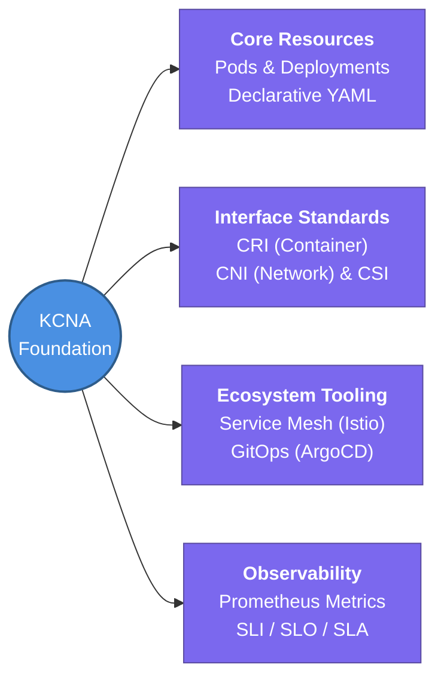

---
tags:
  - kubernetes/core
  - review
status: not-started
Repetition: rep/1
Next-Review: 
---
# KCNA: Kubernetes and Cloud Native Associate

This is the hub note for the KCNA certification track within the Kubestronaut curriculum, laying the foundational architectural principles of containers, Kubernetes orchestration, and cloud-native ecosystem tooling.

## 📖 Core Concepts
- **Cloud Native Philosophy:** Developing apps as scalable microservices in dynamic environments (public, private, hybrid clouds), managed through declarative YAML specifications, container encapsulation, and automated orchestration.
- **Open-Standards & Architecture:** Standardization across Container Runtime Interface (CRI), Container Networking Interface (CNI), and Container Storage Interface (CSI) ensuring platform independence and ecosystem extendability.
- **GitOps & Observability Integration:** Shifting from manual imperative configurations to declarative Git-driven reconciliations (ArgoCD) backed by automated metrics and SLAs (Prometheus, SLI/SLO engineering).

## 🧭 Subtopics
- [[KCNA/Kubernetes-Fundamentals|Kubernetes Fundamentals]] — cloud-native principles, container encapsulation, architecture components, and CRI differences (Docker vs ContainerD).
- [[KCNA/Kubernetes-Resources|Kubernetes Resources]] — atomic declarative workloads: Pods, ReplicaSets, Deployments, Namespaces, and imperative vs. declarative workflows.
- [[KCNA/Scheduling-and-Affinity|Scheduling & Affinity]] — pod placement governance via labels, taints, tolerations, node affinity, resource quotas, and DaemonSets.
- [[KCNA/Security-Primitives|Security Primitives]] — cluster authentication, KubeConfig structures, Role-Based Access Controls (RBAC), Service Accounts, and Network Policies.
- [[KCNA/Networking-and-CNI|Networking & CNI]] — pod-to-pod flat network routing, CNI plugins (Weave), CoreDNS resolution, and ingress HTTP controllers.
- [[KCNA/Service-Mesh-Istio|Service Mesh & Istio]] — sidecar traffic injection, Envoy proxy architectures, mutual TLS (mTLS), and microservice observability.
- [[KCNA/Storage-and-CSI|Storage & CSI]] — decoupling container ephemeral storage with CSI volume drivers, Persistent Volumes (PV), and Storage Classes.
- [[KCNA/Cloud-Native-Architecture|Cloud Native Architecture]] — auto-scaling paradigms (HPA / VPA), serverless paradigms, KEPs, and open community standards (SIGs).
- [[KCNA/Observability-and-FinOps|Observability & FinOps]] — telemetry ingestion via Prometheus, runtime anomalies with Falco, SLO/SLI engineering, and cluster cost management.
- [[KCNA/Application-Delivery-GitOps|Application Delivery & GitOps]] — push vs. pull deployment pipelines and continuous delivery reconciliation with ArgoCD.

## 🔗 Connections (Zettelkasten)
- **Relates to:** [[2. CKA - Kubernetes Administrator]] — administrative dive into configuring these architectural concepts at scale.
- **Relates to:** [[4. KCSA - Security Associate]] — deeper mapping of trust boundaries across cloud-native microservices.
- **Core Use Case:** Serving as the architectural blueprint for migrating legacy monoliths to declarative, scalable Kubernetes microservices managed via GitOps pipelines.

---

## 🏗️ Proof of Work
- **Lab/Script:** [[0.2. Labs#lab-1-1-local-ha-cluster-provisioning-via-kubeadm-kind|Lab 1.1: Local Cluster Setup with Kind]]
- **Verification Command:** `kubectl get componentstatuses; kubectl get namespaces`

---

## 🛠️ Study Aids
### 🧠 Mind Map (Overview)

### 🗂️ Flashcards
#flashcards/kubernetes

What is the fundamental difference between declarative and imperative Kubernetes operations?
?
Declarative operations state the desired desired system state in YAML manifests applied via `kubectl apply`, letting controllers handle reconciliation, whereas imperative commands directly instruct the API server on explicit step-by-step alterations.

Why does Kubernetes rely on open interface standards like CRI, CNI, and CSI?
?
To decouple core cluster scheduling logic from specific vendors or implementations (e.g., swapping Docker for containerd, or Flannel for Cilium) without rewriting control plane source code.
