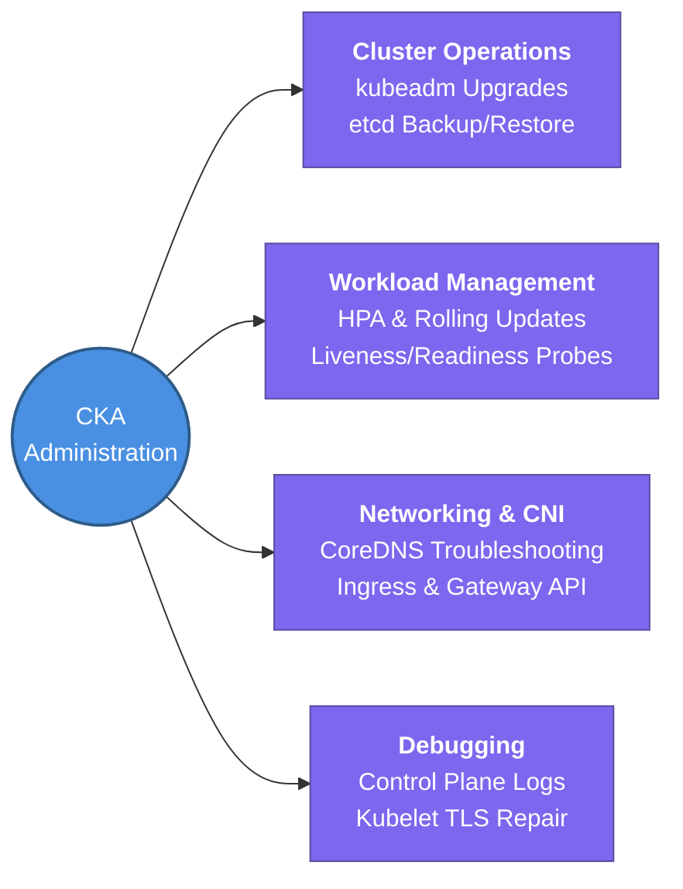

---
tags:
  - kubernetes/core
  - review
status: not-started
Repetition: rep/1
Next-Review: 
---
# CKA: Certified Kubernetes Administrator

This is the hub note for the CKA certification track, mastering cluster installation, high-availability maintenance, control plane debugging, and production networking across Kubernetes infrastructures.

## 📖 Core Concepts
- **Control Plane Architecture:** Deep command of `kube-apiserver` API interactions, `etcd` distributed key-value storage maintenance, `kube-scheduler` algorithmic scoring, and `kubelet` worker execution loops.
- **Application Lifecycle & High Availability:** Managing zero-downtime rolling deployments, automated horizontal pod scaling (HPA), database decoupling with Persistent Volume Claims (PVC), and multi-container logging/monitoring.
- **Production Troubleshooting & Maintenance:** Performing low-level node cordoning and draining, zero-downtime control plane version upgrades (`kubeadm upgrade`), network DNS debugging, and certificate PKI management.

## 🧭 Subtopics
- [[CKA/Control-Plane-and-Etcd|Control Plane & etcd]] — architecture fundamentals, component responsibilities, extension interfaces, and declarative workload orchestration.
- [[CKA/Advanced-Scheduling|Advanced Scheduling]] — manual pod binding, node affinity rules, taints & tolerations, Resource Quotas, DaemonSets, and custom Scheduler Profiles.
- [[CKA/Logging-and-Monitoring|Logging & Monitoring]] — deploying the Kubernetes Metrics Server and aggregating stdout/stderr container stream logs.
- [[CKA/Application-Lifecycle|Application Lifecycle]] — managing rolling updates/rollbacks, ConfigMaps/Secrets ingestion, Probes (Liveness/Readiness), HPA, and multi-container patterns.
- [[CKA/Cluster-Maintenance|Cluster Maintenance]] — OS kernel patching workflows, version migration paths, `kubeadm` upgrades, and reliable `etcdctl` disaster recovery snapshots.
- [[CKA/RBAC-and-Security|RBAC & Security]] — TLS certificate generation, KubeConfig contexts, RBAC cluster role binding, security contexts, and Admission Controllers.
- [[CKA/Storage-and-Provisioning|Storage & Provisioning]] — mounting Docker storage volumes, binding Persistent Volumes (PV/PVC), and dynamically provisioning Storage Classes.
- [[CKA/Cluster-Networking|Cluster Networking]] — Linux net-namespaces, CNI plugin wiring, CoreDNS resolution troubleshooting, Ingress controllers, and modern Gateway API routes.
- [[CKA/Kubeadm-Helm-Kustomize|Kubeadm, Helm & Kustomize]] — bootstrapping HA infrastructure, templating charts with Helm, and declarative configuration patching with Kustomize.
- [[CKA/Production-Troubleshooting|Production Troubleshooting]] — diagnosing control plane crashes, `kubelet` certificate expiration, broken DNS resolution, and CNI routing failures.

## 🔗 Connections (Zettelkasten)
- **Relates to:** [[5. CKS - Security Specialist]] — acts as the essential operational foundation required before implementing advanced runtime hardening and threat auditing in CKS.
- **Relates to:** [[6. EKS Architecture|EKS Architecture]] — translates native bare-metal `kubeadm` administration into AWS cloud-managed node group infrastructures.
- **Core Use Case:** Bootstrapping, scaling, operating, and recovering production-grade Kubernetes clusters reliably without relying solely on cloud provider wizard abstractions.

---

## 🏗️ Proof of Work
- **Lab/Script:** [[0.2. Labs#lab-1-2-etcd-backup-and-disaster-recovery-restore|Lab 1.2: etcd Backup & DR Restore]]
- **Verification Command:** `ETCDCTL_API=3 etcdctl --endpoints=https://127.0.0.1:2379 endpoint health; kubectl get nodes`

---

## 🛠️ Study Aids
### 🧠 Mind Map (Overview)

### 🗂️ Flashcards
#flashcards/kubernetes

How do you safely remove a worker node from production service for OS patching or upgrading?
?
First run `kubectl cordon <node>` to mark it unschedulable, then run `kubectl drain <node> --ignore-daemonsets --delete-emptydir-data` to evict running Pods safely onto healthy worker nodes.

What two TLS certificate files are mandatory when executing an `etcdctl snapshot save` on a secured Kubernetes cluster?
?
You must specify the etcd server/peer certificate (`--cert`) and private key (`--key`), along with the trusted certificate authority bundle (`--cacert`), typically located in `/etc/kubernetes/pki/etcd/`.
