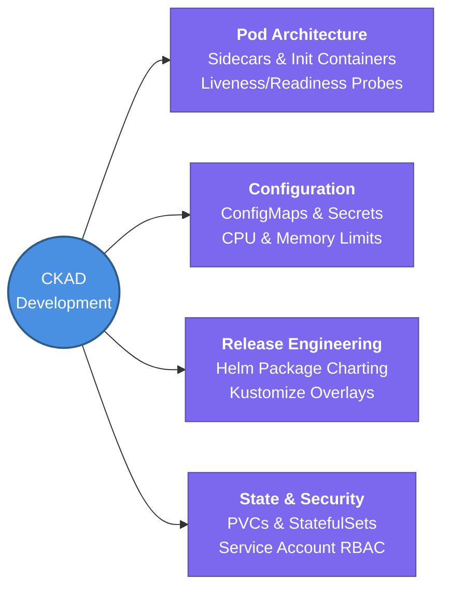

---
tags:
  - kubernetes/core
  - review
status: not-started
Repetition: rep/1
Next-Review: 
---
# CKAD: Certified Kubernetes Application Developer

This is the hub note for the CKAD certification track, focused on architecting resilient, observable cloud-native applications using multi-container design patterns, declarative packaging (Helm/Kustomize), and advanced pod configuration.

## 📖 Core Concepts
- **Resilient Application Architecture:** Writing efficient containerized application manifests equipped with strict resource limits, liveness/readiness self-healing probes, and graceful termination hooks.
- **Advanced Pod Design Patterns:** Extending standard application workloads without code changes by utilizing modular Sidecar adapters, Ambassador proxy bridges, and blocking Init containers.
- **Declarative Release Engineering:** Utilizing GitOps deployment strategies (Canary vs. Blue-Green releases) orchestrated via Helm templated chart releases and Kustomize environment overlays.

## 🧭 Subtopics
- [[CKAD/Core-Workloads|Core Workloads]] — rapid imperative command line execution (`kubectl run/create`), ReplicaSet scalability, Deployments, and Namespace partitioning.
- [[CKAD/Application-Configuration|Application Configuration]] — injecting container commands/args, wiring dynamic ConfigMaps & Secrets, defining Security Contexts, and setting CPU/Memory quotas.
- [[CKAD/Multi-Container-Patterns|Multi-Container Patterns]] — architecting Sidecar log collectors, Adapter transforms, Ambassador proxies, and dependency-gated Init containers.
- [[CKAD/Observability-and-Probes|Observability & Probes]] — fine-tuning HTTP/TCP Liveness Probes to restart stuck processes and Readiness Probes to protect service load balancers from cold starts.
- [[CKAD/Release-Strategies-and-Kustomize|Release Strategies & Kustomize]] — implementing traffic-shifted Blue-Green/Canary releases, building Kustomize overlays, and automating scheduled batch tasks (Jobs/CronJobs).
- [[CKAD/Services-and-Ingress-Routing|Services & Ingress Routing]] — exposing apps via ClusterIP/NodePort Services, terminating TLS at Ingress controllers, and confining traffic via Network Policies.
- [[CKAD/Stateful-Persistence|Stateful Persistence]] — mounting persistent Docker volumes, provisioning dynamic PVC storage claims, configuring StatefulSets, and leveraging Headless Services.
- [[CKAD/Security-and-CRDs|Security & CRDs]] — locking down app Service Accounts via RBAC, understanding API deprecation cycles, and extending clusters via Custom Resource Definitions (CRD).
- [[CKAD/Helm-Package-Management|Helm Package Management]] — dissecting Helm chart hierarchies, customizing runtime values YAMLs, and managing atomic rollout revisions and rollbacks.

## 🔗 Connections (Zettelkasten)
- **Relates to:** [[2. CKA - Kubernetes Administrator]] — shares core workload declarative syntax but focuses on application-level resilience over infrastructure maintenance.
- **Relates to:** [[4. KCSA - Security Associate]] — guarantees that application container Dockerfiles and YAML definitions adhere to baseline Least Privilege standards.
- **Core Use Case:** Designing scalable Golang microservices deployed onto Kubernetes clusters with zero-downtime release pipelines and modular configuration overlays.

---

## 🏗️ Proof of Work
- **Lab/Script:** [[0.2. Labs#lab-2-1-multi-container-pod-design-patterns|Lab 2.1: Multi-Container Design Patterns]] & [[0.2. Labs#lab-2-2-kustomize-overlay-deployments-dev-vs-prod|Lab 2.2: Kustomize Overlays]]
- **Verification Command:** `kubectl get pods -l app=my-microservice -o jsonpath='{.items[*].status.containerStatuses[*].ready}'`

---

## 🛠️ Study Aids
### 🧠 Mind Map (Overview)

### 🗂️ Flashcards
#flashcards/kubernetes

What happens to a running Pod if its configured Readiness Probe continuously fails?
?
The Kubelet does NOT kill or restart the Pod (unlike a failed Liveness Probe); instead, the endpoints controller removes the Pod's IP address from all matching Kubernetes Service backend pool targets so no live user traffic is routed to it until it recovers.

How do you expose a StatefulSet workload to allow direct DNS addressing to individual replicas (e.g., `mysql-0`, `mysql-1`) rather than load balancing across all pods?
?
Create a Headless Service by explicitly configuring the property `clusterIP: None` in the Service manifest and linking its name in the StatefulSet's `serviceName` field.
