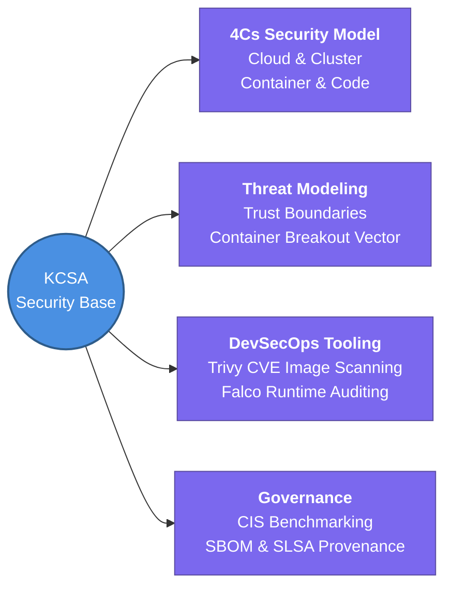

---
tags:
  - kubernetes/security
  - review
status: not-started
Repetition: rep/1
Next-Review: 
---
# KCSA: Kubernetes and Cloud Native Security Associate

This is the hub note for the KCSA security foundation track within the Kubestronaut architecture, mastering the 4Cs cloud-native security threat landscape, component isolation techniques, compliance frameworks, and vulnerability auditing.

## 📖 Core Concepts
- **The 4Cs of Cloud Native Security:** Implementing defense-in-depth across every concentric boundary: Cloud/Infrastructure Provider -> Kubernetes Cluster -> Container Runtime & Images -> Application Code.
- **Threat Modeling & Attack Surface:** Systematically identifying vulnerabilities across data flows, trust boundaries, man-in-the-middle network interception, container privilege escalation, and sensitive Secret exposure.
- **Automated DevSecOps Compliance:** Embedding continuous static security gating (Trivy SBOM vulnerability scanning), admission control checks (OPA/Gatekeeper), and real-time anomaly detection (Falco) directly into CI/CD workflows.

## 🧭 Subtopics
- [[KCSA/Cloud-Native-Security-Overview|Cloud Native Security Overview]] — analyzing the 4Cs model, infrastructure isolation, repository hardening, and application code validation.
- [[KCSA/Cluster-Component-Security|Cluster Component Security]] — locking down the API Server, securing kubelet worker credentials, encrypting etcd datastores, and mitigating `kubectl proxy`/port-forward exposure risks.
- [[KCSA/Security-Fundamentals|Security Fundamentals]] — applying Least Privilege via RBAC, managing Secret encryption, enforcing Namespace isolation, setting resource quotas, and enabling audit logging.
- [[KCSA/Kubernetes-Threat-Model|Kubernetes Threat Model]] — dissecting trust boundaries against STRIDE vectors: persistence, DoS, arbitrary code execution, container breakout, and unauthorized data access.
- [[KCSA/Platform-Security-Tooling|Platform Security Tooling]] — adopting minimal distroless base images, automated vulnerability scanning with Trivy, syscall inspection via Falco, and zero-trust mTLS via Istio Service Mesh.
- [[KCSA/Compliance-and-Frameworks|Compliance & Frameworks]] — mapping Kubernetes architectures to industry regulatory standards (CIS Benchmarks, NIST, SOC2) and software supply chain integrity (SLSA / SBOM provenance).

## 🔗 Connections (Zettelkasten)
- **Relates to:** [[1. KCNA - Cloud Native Associate]] — extends baseline cloud-native architectural patterns with rigorous security and compliance gates.
- **Relates to:** [[5. CKS - Security Specialist]] — acts as the theoretical risk management foundation prior to hands-on command-line kernel hardening and exploit mitigation in CKS.
- **Core Use Case:** Establishing governance, automated threat detection, and compliance auditing for multi-tenant Kubernetes clusters handling sensitive enterprise workloads.

---

## 🏗️ Proof of Work
- **Lab/Script:** [[0.2. Labs#lab-3-1-cis-benchmarking-and-api-server-hardening|Lab 3.1: CIS Benchmarking Audit]]
- **Verification Command:** `kubectl get clusterrolebindings -o json | jq '.items[] | select(.subjects[].name=="system:anonymous")'`

---

## 🛠️ Study Aids
### 🧠 Mind Map (Overview)

### 🗂️ Flashcards
#flashcards/kubernetes

What are the 4Cs of Cloud Native Security, and why is defense-in-depth crucial across them?
?
The 4Cs stand for **Cloud**, **Cluster**, **Container**, and **Code**. Security defenses must be applied at every layer because a vulnerability at an outer ring (e.g., an unpatched Cloud hypervisor or exposed Cluster API server) compromises all inner layers regardless of how secure the Application Code or Container image is.

What primary security risk does leaving the `system:anonymous` user bound to an RBAC ClusterRole introduce?
?
It allows unauthenticated external HTTP requests to bypass certificate or bearer-token authentication at the Kubernetes API server, potentially granting anonymous actors full read or write capabilities over cluster workloads and secrets.
