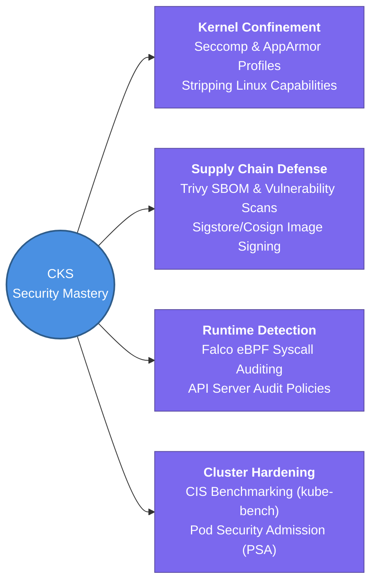

---
tags:
  - kubernetes/security
  - review
status: not-started
Repetition: rep/1
Next-Review: 
---
# CKS: Certified Kubernetes Security Specialist

This is the hub note for the pinnacle CKS certification track, mastering hands-on cluster hardening, Linux host kernel confinement (Seccomp/AppArmor/SELinux), zero-trust supply chain security, and real-time eBPF intrusion detection. *(Requires active CKA)*

## 📖 Core Concepts
- **Host & Node Kernel Hardening:** Limiting container kernel surface attack area by restricting Linux syscalls with custom Seccomp profiles, binding AppArmor security domains, and stripping elevated privileges (`CAP_SYS_ADMIN`).
- **Zero-Trust Software Supply Chain:** Enforcing artifact provenance by generating Software Bill of Materials (SBOM), signing container layers with Cosign/Sigstore, and configuring mutating/validating Admission Controllers (OPA Gatekeeper / Kyverno) to reject unsigned or untrusted registries.
- **Runtime Intrusion Defense & Immutable Infrastructure:** Leveraging eBPF engines (Falco, Tracee) to capture anomalous in-memory syscalls (such as interactive shell spawning inside running pods) and enforcing read-only root filesystem container runtimes (gVisor/Kata sandboxing).

## 🧭 Subtopics
- [[CKS/Attack-Surface-Analysis|Attack Surface Analysis]] — mapping advanced exploit chains across the cloud-native 4Cs threat landscape.
- [[CKS/Cluster-Setup-Hardening|Cluster Setup Hardening]] — performing automated CIS benchmark remediation with `kube-bench`, locking down API server TLS flags, auditing RBAC vs. ABAC, disabling insecure dashboard extensions, and hardening Docker/Containerd socket daemons.
- [[CKS/Linux-System-Hardening|Linux System Hardening]] — executing Least Privilege host modifications, stripping unnecessary SSH/IAM permissions, disabling host open ports, profiling syscalls via AquaSec Tracee, and implementing Seccomp/AppArmor profiles in pod manifests.
- [[CKS/Microservice-Vulnerability-Mitigation|Microservice Vulnerability Mitigation]] — enforcing Pod Security Admission (PSA) policies (Privileged vs. Baseline/Restricted), designing Open Policy Agent (OPA Gatekeeper) rules, container hypervisor sandboxing (gVisor / Kata Containers), and Cilium eBPF network filtering.
- [[CKS/Supply-Chain-Security|Supply Chain Security]] — building static manifest rules with KubeLinter, trimming base image vectors via Distroless containers, creating ImagePolicyWebhooks, signing images with Sigstore, and automated scanning via Trivy.
- [[CKS/Runtime-Monitoring-and-Auditing|Runtime Monitoring & Auditing]] — writing custom Falco engine rule files for behavioral syscall analytics, mitigating active MITRE ATT&CK kill chains, configuring verbose API Server audit logging policies, and enforcing immutable pod deployment architecture.

## 🔗 Connections (Zettelkasten)
- **Relates to:** [[2. CKA - Kubernetes Administrator]] — required prerequisite; builds directly on top of CKA control plane administration by applying stringent security hardening across every API interaction.
- **Relates to:** [[6. EKS Architecture|EKS Architecture]] — implementing container sandboxing and runtime monitoring inside AWS EKS managed compute node infrastructures.
- **Core Use Case:** Achieving financial-grade zero-trust Kubernetes security postures resilient against zero-day CVE exploits, container escape attacks, and insider software supply chain tampering.

---

## 🏗️ Proof of Work
- **Lab/Script:** [[0.2. Labs#lab-3-2-zero-trust-network-policies-and-rbac-confinement|Lab 3.2: Zero-Trust NetPol & RBAC]] & [[0.2. Labs#lab-3-3-runtime-threat-detection-with-falco-and-image-vulnerability-scanning|Lab 3.3: Falco Runtime Threat Detection]]
- **Verification Command:** `trivy image --severity CRITICAL my-image:latest; kubectl get events --sort-by='.metadata.creationTimestamp'`

---

## 🛠️ Study Aids
### 🧠 Mind Map (Overview)

### 🗂️ Flashcards
#flashcards/kubernetes

How do you prevent a container from modifying files within its host root filesystem while still allowing application ephemeral logging?
?
Set `readOnlyRootFilesystem: true` under the container's `securityContext` in the YAML manifest, and mount a temporary `emptyDir` volume specifically to the desired logging directory path (e.g., `/tmp` or `/var/log/`).

What is the operational difference between running an application under standard runc versus sandboxed runtimes like gVisor or Kata Containers in CKS?
?
Standard `runc` containers share the primary host OS kernel among all pods (meaning a Kernel exploit risks total node compromise). Sandboxed runtimes like gVisor intercept and emulate syscalls in user space, while Kata Containers encapsulate each pod inside an ultralight micro-virtual machine with an isolated guest kernel.
