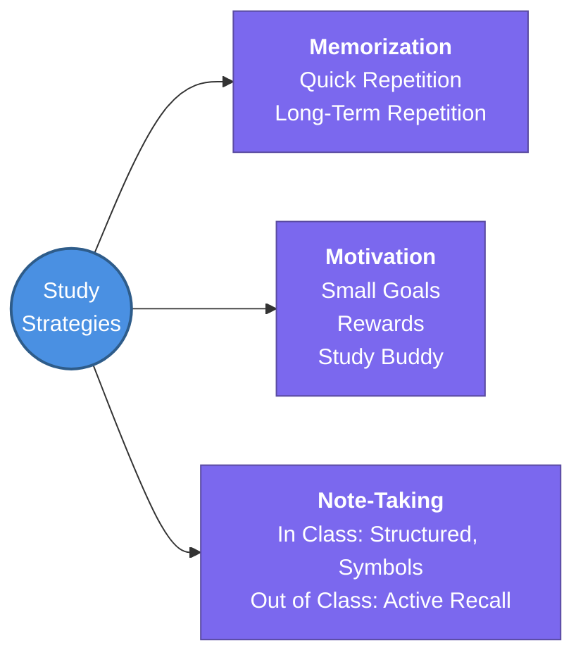

---
tags:
  - productivity/study
  - review
status: completed
---
# 1. Study Habits and Strategies

This hub note covers practical study and productivity strategies aimed at restoring study habits, specifically focusing on memorization techniques, maintaining motivation, and effective note-taking.

## 🧭 Subtopics

## 📖 Core Concepts

### 1. Memorizing Guide 📚

**How to Memorize Anything, Quickly:**
- **1st Repetition:** Immediately after learning
- **2nd Repetition:** After 15–20 minutes
- **3rd Repetition:** After 6–8 hours
- **4th Repetition:** After 24 hours

**How to Memorize Anything, Long-Term:**
- **1st Repetition:** Immediately after learning
- **2nd Repetition:** After 20–30 minutes
- **3rd Repetition:** After 1 day
- **4th Repetition:** After 2–3 weeks
- **5th Repetition:** After 2–3 months

### 2. How to Stay Motivated 🏆

1. **Set Small, Achievable Goals:** Break down tasks into smaller milestones. Checking off tasks provides a sense of progress and keeps you motivated.
2. **Reward Yourself:** Grant yourself small rewards after completing study sessions (e.g., a snack, a short video, or a quick walk).
3. **Find a Study Buddy:** Partnering with a friend makes studying more enjoyable and provides mutual accountability.

### 3. How to Take Notes 📝

**In Class (or During Active Instruction):**
- Use structured notes.
- Use symbols & abbreviations to save time.
- Write down key cues & important info.
- Draw diagrams, boxes, or frames to visualize concepts.

**Out of Class (Review & Organization):**
- Use clear headers for major topics.
- Engage in active recall practice.
- Use bullet points & symbols for readability.
- Apply strategic highlighting & underlining.

## 🔗 Connections (Zettelkasten)
- **Relates to:** [[index|Master Study Plan]]
- **Core Use Case:** Restoring and optimizing study habits for mastering complex engineering topics.

---
## 🏗️ Proof of Work
- **Lab/Script:** [[ ]]
- **Verification Command:** ` `

---
## 🛠️ Study Aids

### 🧠 Mind Map

### 🗂️ Flashcards
#flashcards/productivity

**Q:** What is the spacing schedule for memorizing anything *quickly*?
**A:** 1st: Immediately, 2nd: 15-20 min, 3rd: 6-8 hrs, 4th: 24 hrs.

**Q:** What is the spacing schedule for memorizing anything *long-term*?
**A:** 1st: Immediately, 2nd: 20-30 min, 3rd: 1 day, 4th: 2-3 weeks, 5th: 2-3 months.

**Q:** What are three core strategies to stay motivated while studying?
**A:** Set small achievable goals, reward yourself, and find a study buddy.

**Q:** What are best practices for taking notes *in class*?
**A:** Structured notes, symbols & abbreviations, key cues, and diagrams/boxes.

**Q:** What are best practices for taking notes *out of class*?
**A:** Clear headers, active recall practice, bullet points, and strategic highlighting.
