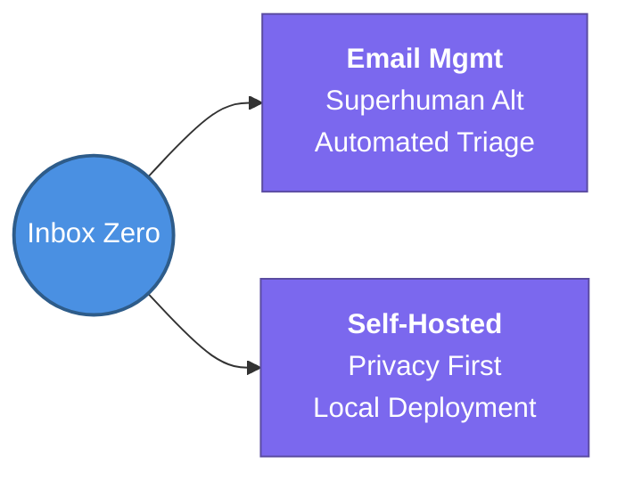

---
tags:
  - productivity/tools
  - review
status: not-started
Repetition: rep/1
Next-Review: 
---
# 2. Inbox Zero
## 📖 Core Concepts
- A *Superhuman* alternative for automated email management.
- Focuses on being self-hosted and privacy-conscious while offering advanced AI categorization and filtering.

## 🔗 Connections (Zettelkasten)
- **Relates to:** [[1. Study Habits and Strategies]]
- **Core Use Case:** Personal productivity and automated email triaging.
---
## 🏗️ Proof of Work
- **Lab/Script:** [[ ]]
- **Verification Command:** `docker-compose up` (Verify local IMAP/SMTP integration)
---
## 🛠️ Study Aids
### 🧠 Mind Map

### 🗂️ Flashcards
#flashcards/productivity
**What problem does the Inbox Zero tool solve?**
?
It provides an automated, self-hosted alternative to email management tools like Superhuman.
