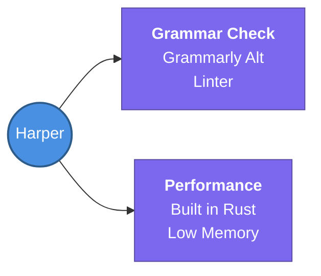

---
tags:
  - productivity/tools
  - review
status: not-started
Repetition: rep/1
Next-Review: 
---
# 3. Harper
## 📖 Core Concepts
- A *Rust-based* grammar linter that acts as a replacement for *Grammarly*.
- Features significantly lower memory usage and extremely fast execution due to its Rust foundation.

## 🔗 Connections (Zettelkasten)
- **Relates to:** [[1. Study Habits and Strategies]]
- **Core Use Case:** Fast, local grammar checking without the bloat of traditional Electron/cloud-based linters.
---
## 🏗️ Proof of Work
- **Lab/Script:** [[ ]]
- **Verification Command:** Install CLI and run `harper check document.md`
---
## 🛠️ Study Aids
### 🧠 Mind Map

### 🗂️ Flashcards
#flashcards/productivity
**Why is Harper considered a highly efficient alternative to Grammarly?**
?
Because it is a grammar linter built in Rust, resulting in significantly lower memory usage and faster execution.
