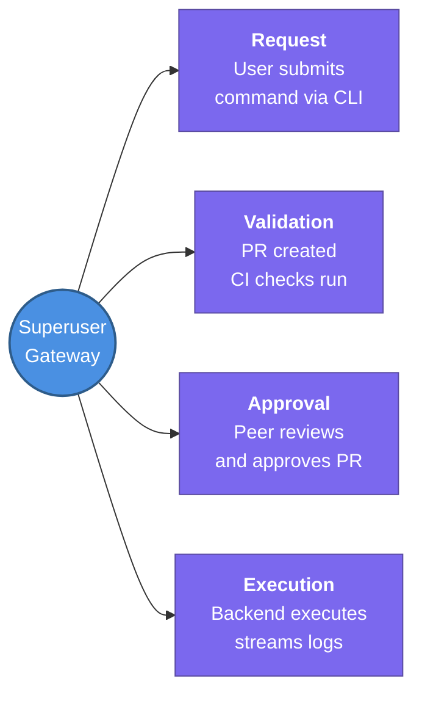

---
tags:
  - system-design
  - review
status: completed
---
# Superuser Gateway (Privileged Access Management)

## 📖 Core Concepts
- **The Problem:** Direct execution of privileged commands (like `rm -r`, `chmod`) by engineers during incidents carries a huge risk (blast radius) and lacks accountability or peer review.
- **The Solution:** A **Superuser Gateway** replaces direct CLI access with a GitOps-style Pull Request workflow.
- **Workflow:** 
  1. Engineer submits command via CLI (e.g. `superuser-cli cmd "..."`).
  2. The system generates a Pull Request in a dedicated Git repo.
  3. Automated CI jobs run validation (syntax, permissions, blast radius estimation).
  4. A peer reviews and approves the PR.
  5. A remote execution service runs the command as the superuser and streams the output back to the user.
- **Benefits:** No local admin credentials, mandatory peer review, automated guardrails, and full auditability (every command execution is tied to a specific PR and approval).
- **Inspiration:** Developed by Uber Engineering to secure their massive data platform (HDFS, GCS) from catastrophic operational mistakes.

## 🔗 Connections (Zettelkasten)
- **Relates to:** [[3. Atlantis]] (Similar GitOps paradigm, but for running arbitrary admin scripts instead of Terraform).
- **Core Use Case:** Securing high-risk manual operational tasks without slowing down incident response.

---
## 🏗️ Proof of Work
- **Lab/Script:** [[ ]]
- **Verification Command:** ` `

---
## 🛠️ Study Aids
### 🧠 Mind Map

### 🗂️ Flashcards

What is a Superuser Gateway?
?
It is a system that wraps risky, privileged commands in a GitOps workflow where commands are submitted as PRs, validated, peer-reviewed, and executed remotely, removing the need for local admin credentials.
#flashcards/cicd

What are the three main steps of a Superuser Gateway workflow?
?
1. **Submission/Validation** (CLI creates a PR, CI runs checks) 2. **Peer Review** (Approval) 3. **Remote Execution** (Service runs it securely).
#flashcards/cicd
